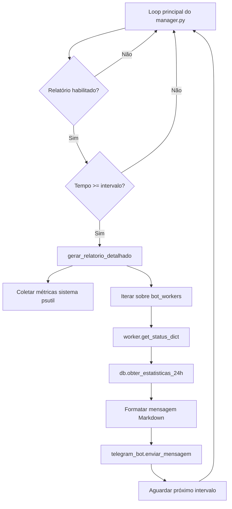

# 📊 Relatório Horário Detalhado via Telegram

## 🎯 Visão Geral

O sistema de relatório horário foi completamente refatorado para fornecer métricas detalhadas sobre a saúde do sistema, performance dos bots e estatísticas financeiras nas últimas 24 horas.

---

## 🆕 O Que Foi Implementado

### 1. Dependências Adicionadas

**Arquivo**: `requirements.txt`

```bash
# Monitoramento de sistema (CPU, memória)
psutil==5.9.6
```

**Instalação**:
```bash
pip install psutil==5.9.6
```

---

### 2. Novos Métodos no DatabaseManager

**Arquivo**: `src/persistencia/database.py`

#### `obter_estatisticas_24h()`

Já existia! Este método retorna estatísticas das últimas 24 horas:

```python
{
    'compras': 5,           # Total de compras nas últimas 24h
    'vendas': 2,            # Total de vendas nas últimas 24h
    'lucro_realizado': 12.50  # Lucro total realizado (USDT)
}
```

**Localização**: `src/persistencia/database.py:644-683`

---

### 3. get_status_dict() Enriquecido

**Arquivo**: `src/core/bot_worker.py:666-741`

#### Novos Campos Adicionados:

```python
{
    # ... campos existentes ...

    # NOVOS CAMPOS
    'compras_24h': 5,              # Compras nas últimas 24h
    'vendas_24h': 2,               # Vendas nas últimas 24h
    'lucro_realizado_24h': 12.50,  # Lucro realizado (USDT)
    'thread_ativa': True           # Status da thread do bot
}
```

**Exemplo de Uso**:

```python
status = bot_worker.get_status_dict()
print(f"Compras 24h: {status['compras_24h']}")
print(f"Vendas 24h: {status['vendas_24h']}")
print(f"Lucro realizado: ${status['lucro_realizado_24h']:.2f}")
print(f"Thread ativa: {status['thread_ativa']}")
```

---

### 4. Função de Geração de Relatório

**Arquivo**: `manager.py:51-185`

#### `gerar_relatorio_detalhado(bot_workers, inicio_gerente)`

Esta função coleta e formata:

1. **Métricas do Sistema**:
   - Uso de CPU (via psutil)
   - Uso de memória RAM (via psutil)
   - Tamanho dos bancos de dados
   - Uptime do gerenciador
   - Status das threads (✅ ativa / ❌ inativa)

2. **Métricas por Bot**:
   - Nome e exchange
   - Estado operacional
   - Posição atual e preço médio
   - Lucro/Prejuízo da posição (não realizado)
   - Performance 24h (compras e vendas)
   - Lucro realizado nas últimas 24h

3. **Resumo Global**:
   - Capital total (USDT + posições)
   - Lucro global não realizado
   - Lucro global realizado nas últimas 24h

---

## 📋 Layout do Relatório

Exemplo de mensagem enviada via Telegram:

```
🔔 RELATÓRIO DE INTELIGÊNCIA DOS BOTS
-----------------------------------
Atualizado em: 2025-10-18 13:00:00

💻 SAÚDE DO SISTEMA
CPU: 15.5% | Memória: 25.0%
DB Binance: 1.25 MB | DB KuCoin: 0.50 MB
Uptime do Gerente: 24h 15m
Threads: [ADA ✅] [XRP ✅]
-----------------------------------

🤖 BOT: ADA-Binance (ADA/USDT)
Estado: Exposição Máxima | Compras Suspensas
Posição: 345.7 ADA @ $0.6879
L/P Posição: -8.80% (-20.99 USDT)
Desempenho 24h: 1 Compra(s) | 0 Venda(s)
Lucro Realizado 24h: +0.00 USDT

🤖 BOT: XRP-KuCoin (XRP/USDT)
Estado: Operando | Aguardando Oportunidade
Posição: 20.9 XRP @ $2.3800
L/P Posição: -3.25% (-1.73 USDT)
Desempenho 24h: 0 Compra(s) | 0 Venda(s)
Lucro Realizado 24h: +0.00 USDT

-----------------------------------
🌐 RESUMO FINANCEIRO GLOBAL
Capital Total: $301.67 USDT
L/P Global (Não Realizado): -22.72 USDT
Lucro Global (Realizado 24h): +0.00 USDT
```

---

## ⚙️ Como Ativar o Relatório Horário

### 1. Configurar no `config.json`

Edite o arquivo `configs/config.json`:

```json
{
  "bots_ativos": ["ADA", "XRP"],
  "relatorio_horario": {
    "habilitado": true,
    "intervalo_horas": 1
  }
}
```

**Opções**:
- `habilitado`: `true` para ativar, `false` para desativar
- `intervalo_horas`: Intervalo entre relatórios (1 = a cada hora)

### 2. Verificar Variáveis de Ambiente

Certifique-se de que o `.env` contém:

```bash
# Telegram Bot
TELEGRAM_BOT_TOKEN=seu_token_aqui
TELEGRAM_AUTHORIZED_USER_ID=seu_user_id
```

### 3. Reiniciar o Sistema

```bash
python manager.py
```

---

## 🔧 Como Funciona Internamente

### Fluxo de Execução



### Código Relevante

**manager.py:387-411**:
```python
# Verificar se é hora de enviar relatório horário via Telegram
if relatorio_habilitado and telegram_bot and authorized_user_id:
    tempo_decorrido = time.time() - ultimo_relatorio_timestamp
    intervalo_segundos = intervalo_horas * 3600

    if tempo_decorrido >= intervalo_segundos:
        logger.info("📊 Gerando relatório horário detalhado...")

        # Gerar relatório completo
        mensagem_relatorio = gerar_relatorio_detalhado(bot_workers, inicio_gerente)

        # Enviar via Telegram
        try:
            import asyncio
            asyncio.run(telegram_bot.enviar_mensagem(
                user_id=int(authorized_user_id),
                mensagem=mensagem_relatorio
            ))
            logger.info("✅ Relatório horário enviado!")
        except Exception as e:
            logger.error(f"❌ Erro ao enviar: {e}")

        ultimo_relatorio_timestamp = time.time()
```

---

## 📊 Métricas Disponíveis

### Sistema
| Métrica | Origem | Descrição |
|---------|--------|-----------|
| **CPU %** | `psutil.cpu_percent()` | Uso de CPU do sistema |
| **Memória %** | `psutil.virtual_memory().percent` | Uso de RAM do sistema |
| **DB Size** | `os.path.getsize(db_path)` | Tamanho do banco de dados |
| **Uptime** | `datetime.now() - inicio_gerente` | Tempo online do gerenciador |
| **Threads** | `worker.rodando` | Status das threads dos bots |

### Bot (Para cada bot)
| Métrica | Origem | Descrição |
|---------|--------|-----------|
| **Estado** | `get_status_dict()['estado_bot']` | Estado operacional |
| **Posição** | `get_status_dict()['status_posicao']` | Quantidade e PM |
| **L/P Posição** | `position_manager.calcular_lucro_atual()` | Lucro não realizado |
| **Compras 24h** | `db.obter_estatisticas_24h()['compras']` | Total de compras |
| **Vendas 24h** | `db.obter_estatisticas_24h()['vendas']` | Total de vendas |
| **Lucro 24h** | `db.obter_estatisticas_24h()['lucro_realizado']` | Lucro realizado |

### Global
| Métrica | Cálculo | Descrição |
|---------|---------|-----------|
| **Capital Total** | Σ(saldo_usdt + valor_posicao) | Todo capital disponível |
| **L/P Não Realizado** | Σ(lucro_usdt de cada bot) | Lucro em posições abertas |
| **Lucro Realizado 24h** | Σ(lucro_realizado_24h de cada bot) | Lucro de vendas 24h |

---

## 🛠️ Personalização

### Alterar Formato da Mensagem

Edite a função `gerar_relatorio_detalhado()` em `manager.py:51-185`.

Exemplo para adicionar mais informações:

```python
linhas.extend([
    f"🤖 *BOT: {nome}-{exchange}* `({par})`",
    f"*Estado:* {estado}",
    f"*Posição:* `{quantidade:.1f} {ativo_base}` @ `${preco_medio:.4f}`",
    f"*L/P Posição:* {lp_pct:+.2f}% ({lp_usdt:+.2f} USDT)",
    f"*Desempenho 24h:* {compras_24h} Compra(s) | {vendas_24h} Venda(s)",
    f"*Lucro Realizado 24h:* {lucro_realizado_24h:+.2f} USDT",

    # ADICIONE NOVOS CAMPOS AQUI
    f"*SMA Referência:* ${status.get('sma_referencia', 0):.4f}",
    f"*Distância SMA:* {status.get('distancia_sma', 0):.2f}%",
    ""
])
```

### Alterar Intervalo do Relatório

Opções em `configs/config.json`:

```json
{
  "relatorio_horario": {
    "habilitado": true,
    "intervalo_horas": 6  // A cada 6 horas
  }
}
```

---

## 🐛 Troubleshooting

### Relatório não está sendo enviado

1. **Verificar se está habilitado**:
   ```json
   "relatorio_horario": { "habilitado": true }
   ```

2. **Verificar credenciais do Telegram**:
   ```bash
   echo $TELEGRAM_BOT_TOKEN
   echo $TELEGRAM_AUTHORIZED_USER_ID
   ```

3. **Verificar logs**:
   ```bash
   tail -f logs/*.log | grep "relatório"
   ```

### Erro ao coletar estatísticas 24h

Verifique se o método existe no DatabaseManager:
```python
# Teste direto
from src.persistencia.database import DatabaseManager
db = DatabaseManager(db_path=Path('dados/bot_trading.db'), backup_dir=Path('dados/backup'))
print(db.obter_estatisticas_24h())
```

### Erro de importação do psutil

Instale a dependência:
```bash
pip install psutil==5.9.6
```

---

## 📝 Arquivos Modificados

| Arquivo | Linhas | Modificações |
|---------|--------|--------------|
| `requirements.txt` | 37-38 | Adicionado `psutil==5.9.6` |
| `src/core/bot_worker.py` | 666-741 | Enriquecido `get_status_dict()` |
| `manager.py` | 1-11 | Importações (psutil, datetime, Path) |
| `manager.py` | 51-185 | Função `gerar_relatorio_detalhado()` |
| `manager.py` | 192 | Variável `inicio_gerente` |
| `manager.py` | 387-411 | Nova lógica de envio de relatório |

---

## ✅ Checklist de Implementação

- [x] Adicionar `psutil` ao `requirements.txt`
- [x] Método `obter_estatisticas_24h()` no DatabaseManager (já existia!)
- [x] Enriquecer `get_status_dict()` no BotWorker
- [x] Criar função `gerar_relatorio_detalhado()` no manager.py
- [x] Integrar com envio via Telegram
- [x] Testar sintaxe Python
- [x] Documentação completa

---

## 🚀 Próximos Passos (Opcionais)

1. **Gráficos de Performance**:
   - Usar matplotlib para gerar gráficos de lucro
   - Enviar imagens via Telegram

2. **Alertas Inteligentes**:
   - Notificar quando lucro 24h > X USDT
   - Alertar quando threads ficarem inativas

3. **Histórico de Relatórios**:
   - Salvar relatórios em arquivo JSON
   - Comparar performance entre períodos

4. **Dashboard Web**:
   - Interface web com Flask/FastAPI
   - Visualização em tempo real

---

## 📚 Referências

- [Documentação do psutil](https://psutil.readthedocs.io/)
- [Telegram Bot API - Formatting](https://core.telegram.org/bots/api#formatting-options)
- [SQLite Date/Time Functions](https://www.sqlite.org/lang_datefunc.html)

---

**Criado em**: 2025-10-18
**Versão**: 1.0.0
**Autor**: Claude Code Assistant
